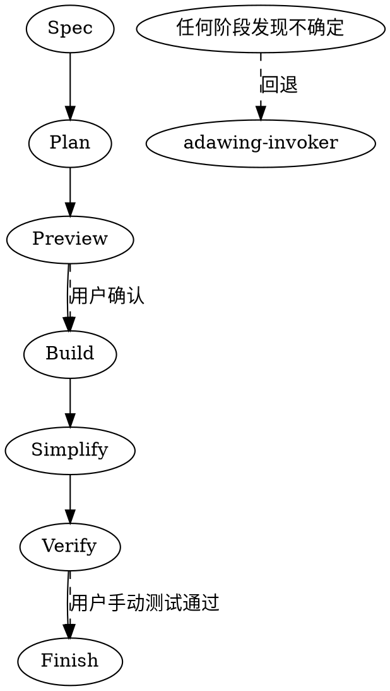

# adawing-workflow —— 代码任务执行工作流

> 承接 `adawing-invoker` 的决策结果，将需求拆解为可验证的阶段，强制产出过程文档，确保每一步都有用户确认或自动化验证。

## 核心原则

代码修改任务一旦决定执行，必须走完 **Spec → Plan → Preview → Build → Simplify → Verify → Finish** 七个阶段。不因任务简单而跳过任何环节。每个阶段产出必须存在，且阶段之间以用户确认或自动化验证为闸门。

## 与 `adawing-invoker` 的关系

- `adawing-invoker` 负责**决策**：PAUSE / FALLBACK / ASK。它在任务入口判断该不该做、用什么最小方案做。
- `adawing-workflow` 负责**执行**：在决策已经明确后，按固定阶段推进任务。
- 如果进入本 workflow 后仍然发现需求不清、范围过大、风险未授权，**立即停止当前阶段，回退到 `adawing-invoker`**，不要在本 skill 中重复实现 PAUSE / FALLBACK / ASK 的逻辑。

## 工作流总览



## 阶段详解

### 阶段 1：Spec（需求分析）

- **必需子 skill：** `superpowers:brainstorming`
- **产出：** `docs/superpowers/specs/YYYY-MM-DD-<topic>-design.md`
- **强制内容：**
  - 明确 Non-Goals（不做范围）
  - 至少 3 个风险假设
  - 数据表影响（涉及哪些表/字段）
  - 前后端联动范围（API 文件 + views 页面）
  - 金额字段必须注明精度与单位
  - 审批流改动必须画出状态流转图
- **记忆反馈：** `pause-on-uncertainty` — 分析中出现连续 2 次以上“可能/也许/大概”时，停止分析并提交未确认清单给用户。

### 阶段 2：Plan（实施计划）

- **必需子 skill：** `superpowers:writing-plans`
- **产出：** `docs/superpowers/plans/YYYY-MM-DD-<feature-name>.md`
- **强制内容：**
  - 每个任务列出目标文件（前后端双端）
  - 每个任务列出验证方式
  - 每个任务列出回滚步骤
  - 引用 Preview 文件路径（见 Phase 3）
- **记忆反馈：** `workflow-spec-plan-preview-set` — Plan 之后必须进入 Preview，不可直接 Build。

### 阶段 3：Preview（效果预览）—— 强制不可跳过

- **适用范围：** 任何涉及 UI/行为变更的需求，无论多简单。
- **UI 改动：** 产出 `docs/superpowers/previews/YYYY-MM-DD-prev-<topic>/index.html`
- **逻辑/后端改动：** 产出 `docs/superpowers/previews/YYYY-MM-DD-prev-<topic>/flow.html`
- **硬顺序：**
  1. 产出 Preview 后立即向用户展示并询问是否确认。
  2. **收到用户明确“确认”前，禁止调用 Edit/Write 修改生产代码，禁止调用编译/构建工具。**
- **例外：** 纯后端逻辑改动（如仅改 SQL 查询条件）可酌情省略，但需向用户说明并获认可。
- **记忆反馈：** `preview-mandatory`

### 阶段 4：Build（编码实现）

- **必需子 skill：** `superpowers:subagent-driven-development`（推荐）或 `superpowers:executing-plans`
- **强制行为：**
  - 严格按 Plan 的 Step 顺序执行
  - 每改动一个文件，立即运行相关增量测试/编译
  - 禁止批量修改未在 Plan 中列出的文件
  - 禁止顺手重构无关代码、禁止批量格式化
- **工具约束：** 必须先使用 Codegraph MCP 工具扫描项目上下文，再动手读取具体文件。
  - 列出文件 → `codegraph_files`
  - 查看符号定义与调用链 → `codegraph_explore`
  - 查找调用方 → `codegraph_callers`
  - 评估修改影响 → `codegraph_impact`
- **记忆反馈：** `codegraph-usage-feedback`

### 阶段 5：Simplify（简化审查）

- 删除未使用的导入、变量、函数
- 合并重复的代码块
- 降低嵌套层级（提前返回替代深层 if-else）
- 消除不必要的抽象

### 阶段 6：Verify（全量验证）—— 两态管理

- **必需子 skill：** `superpowers:verification-before-completion`
- **产出：** `docs/superpowers/verify/YYYY-MM-DD-<topic>.md`
- **检查项：**
  - Lint: 无 Error
  - Test: 新增/修改测试全绿
  - Build: 编译/打包成功
  - Simplify: 通过
- **状态机：**
  1. **草稿态**：代码修改 + 构建通过后，产出 Verify 报告，状态标注为 **“待用户本地手动测试确认”**。此时严禁声称任务已完成。
  2. **终态**：用户逐项完成测试清单并反馈“通过”后，更新状态为 **“已完成”**。
- **记忆反馈：** `verify-after-manual-test`

### 阶段 7：Finish（收尾）

- **必需子 skill：** `superpowers:finishing-a-development-branch`
- 测试未通过时不得呈现选项，必须先修复。
- 提交信息遵循 `type(scope): short description` 格式，详细说明放 body，不要包含 issue/P0 编号，不要附加 AI 署名。
- 涉及 Filter、认证、部署健康检查等运行时行为，必须启动应用实际验证。
- **记忆反馈：** `git-commit-style-constraint`

## 模式映射

| 任务类型 | 模式 | 特殊路径 |
|----------|------|----------|
| 新功能/需求变更/性能优化 | MODE_REQ | 完整 7 阶段 |
| Bug/测试失败/异常行为 | MODE_DEBUG | `superpowers:systematic-debugging` |
| 根因明确的修复 | MODE_FIX | TDD → Verify |
| 处理 PR/Code Review 反馈 | MODE_REVIEW | `superpowers:receiving-code-review` |
| 安全漏洞 | MODE_VULN | PoC → Patch → Audit |

## 工具链协议

- **批量读取：** 使用 Read 一次性读取相关文件（如 Service + Mapper + Test）
- **精准修改：** 使用 Edit 行级替换；大段重构使用 Write 但必须先 Read 确认
- **搜索定位：** 优先使用 Codegraph MCP 工具，其次 Grep/Glob
- **增量验证：** 每改一个文件，立即运行相关测试
- **全量验证：** 阶段结束前必须运行完整 test + lint + build
- **危险命令二次确认：** git push, rm -rf, DROP, DELETE（无 WHERE）等，确认格式：“即将执行 `<command>`，确认请输入 '确认' 继续。”

## 过程文档约定

过程文档统一放在 `docs/superpowers/`，不提交 git，仅在用户主动要求时提交：

```
docs/superpowers/
specs/     — 需求设计
plans/     — 实施计划
previews/  — 预览 HTML
verify/    — 验证报告
reviews/   — 审查记录
```

## 项目记忆反馈索引

| 记忆 | 应用阶段 |
|------|----------|
| follow-full-workflow | 全部 — 任何代码任务必须完整执行 7 阶段 |
| workflow-spec-plan-preview-set | Spec/Plan/Preview — Plan 后必须 Preview |
| preview-mandatory | Preview — UI/行为变更必须产出 HTML 预览 |
| pause-on-uncertainty | Spec/Plan — 不确定时回退到 invoker |
| verify-after-manual-test | Verify — 用户手动测试后才能标记完成 |
| codegraph-usage-feedback | Build — 强制使用 Codegraph MCP |
| git-commit-style-constraint | Finish — 提交格式与运行时验证 |

## 危险信号 —— 停止并回退到 `adawing-invoker`

- 阶段中发现需求还有多种解释
- 用户说“简单改一下”但影响范围未明确
- 准备执行删除/覆盖/配置变更前未说明风险
- 想跳过 Preview 或 Verify
- 连续出现“可能/也许/大概”

这些信号意味着决策层尚未充分澄清，必须回退到 `adawing-invoker`。
