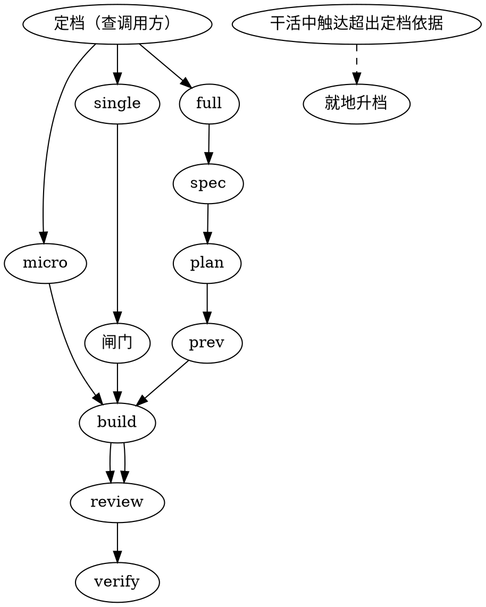

# adawing-workflow —— 按规模分档的执行流程

> 维护与开发交替进行，流程强度应当随之变化。
> 规模小就少跑阶段，规模大才值得完整留档。不因流程完整而给琐碎任务加税。

## 核心原则

代码任务按改动规模分为 **micro / single / full** 三档，各档跑不同阶段。档位不由任务"看起来重不重"决定，而由三个布尔量决定。定档前必须先查调用方，不许凭印象。

`micro` 与 `single` 的全部要求都在本文件内。定到 `full` 时再读 [references/full-tier.md](references/full-tier.md) —— 那里是 spec / plan 文件 / prev / verify 的细则，前两档不需要。

## 与其他 skill 的关系

本 skill 可单装，以下都是**软依赖** —— 对方未装时本 skill 不失效，只是覆盖面变窄。

| 对方 | 边界 | 对方未装时 |
|---|---|---|
| `adawing-invoker` | 它管歧义：该怎么做、是否需要先问 | 照常分档，不代管歧义判定 |
| `superpowers` | `full` 档的 spec / plan 借用它的 skill | `full` 档自行写 spec / plan，格式见 references |

与 `adawing-invoker` 判据正交：无歧义的大重构走 `self` + `full`，指令模糊的一行改动走 `PAUSE` + `micro`。引用对方时只援引边界，不复述对方的内部机制 —— 对方改版时本 skill 不必跟着改。

## 流程总览



---

## 定档

### 判据（三个布尔量，不是文件计数）

- 是否跨模块边界
- 是否改公共接口
- 是否改数据形状

全否 → `micro`；命中一条 → `single`；命中两条以上，或需求本身包含多个子功能 → `full`。

### 必须执行的动作

1. **先查一次调用方**，并在 tier 行里引用结果。优先 codegraph（`codegraph_explore`，仅当项目已建 `.codegraph/` 索引），否则 Grep/Glob
2. 输出 tier 行与阶段行，各一行，不展开论证
3. 理由只能援引规模

> "要碰几个文件"恰恰是任务开始时的未知量 —— 抽一个函数看着是两个文件，调用方可能有四十处。

### 输出格式

```markdown
[TIER: single] <规模理由，引用检索结果>
阶段：plan → build → review
```

### 棘轮

干活中发现实际触达超出定档依据时，就地升档并补做缺失阶段，或明确说明为何豁免。升到 `full` 时先读 `references/full-tier.md`。

> 不许靠分批改动规避升档。

### 禁止行为

写出 `[TIER: single] 因为需求不清` 是格式错误 —— 那是 `adawing-invoker` 的歧义门在管的事。

---

## 各档阶段

| 档 | 阶段 | 过程文档 |
|---|---|---|
| `micro` | (prev 按需) → build | 无 |
| `single` | plan → (prev 按需) → build → review/simplify | 行内 |
| `full` | spec → plan → prev → build → review/simplify → verify | 见 references |

**plan（`single` 行内即可）：** 目标文件、验证方式、回滚步骤，外加一行验收条件与一行 Non-Goals。不出文件。

**build（全档）：** 按 plan 顺序执行，每改一个文件立即跑相关增量验证。不批量修改计划外文件，不顺手重构无关代码，不批量格式化。

**review / simplify（`single` 起）：** 删除未使用的导入与变量、合并重复代码、用提前返回降低嵌套、消除不必要的抽象。

**prev（按需）：** 只是可视化结果预览。`micro` 默认不出，UI 改动面较大时出；`single` 按需。产出 `docs/superpowers/previews/YYYY-MM-DD-<topic>/index.html`，同一页分区呈现。

**verify（`micro` / `single`）：** 口头一行说明 lint / test / build 结果即可，不出报告文件。

---

## 闸门 —— 动手前给一次可否决的陈述

### 适用范围

`single` 与 `full` 档强制；`micro` 档免除，前提是改动可逆。

**可逆 = 改动以 diff 形式落在 git 跟踪的文件上。** 删文件、覆盖非跟踪文件、写数据库、跑迁移都不算 —— 这类改动即使规模是 `micro` 也要走闸门。

### 必须执行的动作

动生产代码前给出三行，一行一条：

1. 要改哪些文件
2. 行为的前后差异
3. 判定通过的条件

**三行就是三行**，不附加风险分析与备选方案讨论。收到用户确认前，不动生产代码。

> 闸门是行为约束，不绑定产出物。纯后端改动没有可视化预览，但一样要有这三行 —— 否则第一个可干预点会落在代码已经改完之后。

---

## 全局规则 —— 不随档位变化

**两态：** 构建通过不等于完成。未经用户手动测试确认，不得声称任务已完成。这条对三个档都生效。

**运行时验证：** 涉及 Filter、认证、部署健康检查等运行时行为，必须启动应用实际验证，不能只靠编译通过。

**提交约定：** 仅当用户要求提交时生效。格式 `type(scope): short description`，详细说明放 body，不带 issue 编号，不加 AI 署名。测试未通过时不呈现收尾选项，先修复。分支收尾等用户主动提起。

**过程文档：** 统一放 `docs/superpowers/`，不提交 git，除非用户要求。

---

## 与 superpowers 的关系

`micro` 与 `single` 档**取代** `superpowers:brainstorming` 的设计批准闸门 —— 本档的闸门三行即为设计陈述（装了 `adawing-invoker` 时，其 `EVALUATION` 的默认动作同样够用），不再走完整问答流程。

> 不写明这一条，两档会被 brainstorming 的 HARD-GATE 压回完整流程。

`full` 档才拉 brainstorming，细则见 references。任务类型对应的前置 skill：

| 任务类型 | 前置 skill |
|---|---|
| bug / 测试失败 / 异常行为 | `superpowers:systematic-debugging` |
| PR / code review 反馈 | `superpowers:receiving-code-review` |
| 新功能（full 档） | `superpowers:brainstorming` → `superpowers:writing-plans` |
| 安全漏洞 | PoC → Patch → Audit |

---

## 硬规则

只有这三条是硬规则，evals 可判：

1. `single` 与 `full` 档在动生产代码前给出了闸门陈述且等待确认
2. tier 声明的理由援引规模，不援引歧义
3. 无验证证据时不声称完成

其余是指引。规则太多容易沉重，太少容易失控 —— 只有能被驳倒或能被核验的才写成硬规则。

## 附属资源

- `references/full-tier.md` —— `full` 档阶段细则（spec / plan 文件 / prev 强制 / verify 报告 / 过程文档路径）。仅定档为 `full` 或就地升档到 `full` 时读。
